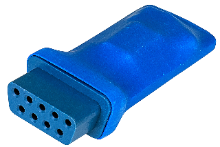

# SaveKey Allocation List

The **SaveKey Allocation List** is a community-maintained registry of persistent
storage allocations for Atari 2600 and 7800 homebrew games. Developers can reserve 
SaveKey/AtariVox pages without conflicting with existing allocations.

> This is a community-maintained project under `atariage-community`. It is not an official AtariAge repository.

## Quick links

- [Browse the visual allocation map](https://atariage-community.github.io/savekey-allocation-list/allocations.html)
- [View the canonical allocation data](allocations.yaml)
- [Request or change an allocation](#requesting-or-changing-an-allocation)

## What is a SaveKey?

The **SaveKey** is a small memory device that plugs into the second controller
port of an Atari 2600 or 7800. It provides 32 KB of non-volatile EEPROM storage
(512 pages of 64 bytes) that games can use to retain high scores, settings, and
progress after the console is switched off. The **AtariVox** provides compatible
storage and adds a built-in speech synthesizer. This registry coordinates how
projects use that shared address space.



## How allocations work

**[`allocations.yaml`](allocations.yaml) is the single source of truth.**
The visual allocation map reads this file directly and provides a visual view with
search and filtering.

### Pages and addresses

The registry uses **64-byte pages**, or storage slots. By default, address
ranges are derived from the page numbers:

- start address = `page × 64`
- end address = `start address + 63`

This avoids page/address mismatches. A developer is normally assigned a complete
page, but multiple games from that developer can share it when each game declares
its exact inclusive `addresses.start` / `addresses.end` range. A game with
discontiguous storage can list `addresses` as multiple ranges.

Address ranges must not overlap. They must fall within and collectively touch
every page named in the `pages` range.

### Allocation statuses

| Status | Use when |
| --- | --- |
| `reserved` | A project does not yet have a qualifying cartridge or ROM release. |
| `allocated` | A cartridge release or released ROM uses the allotted page. |
| `abandoned` | An unreleased project has clear evidence that its developer abandoned it. |

A released ROM can be played from a multi-ROM cartridge; what matters is that
the released software uses the allotted page.

An abandoned entry continues to protect its pages from reuse until maintainers
explicitly free or reassign them. To make the pages available again, remove the
abandoned entry; the visual allocation map will then show them as available.

### Scratchpad pages

Pages `0x0C0–0x0FF` (`0x3000–0x3FFF`) are designated as non-permanent
scratchpad space in the original allocation list. They are represented
explicitly and are therefore not shown as available permanent allocations.

### 7800basic high-score storage

Developers of 7800basic games that use its unified Hi-Score Cart and SaveKey
driver do not need to reserve a separate page here. When a developer [requests a
7800 HSC ID for a game](https://forums.atariage.com/topic/128432-high-score-cart-values/),
7800basic uses that same ID to dynamically identify the game's high-score data.
On a SaveKey, the driver reads and stores that data within the existing
**7800basic High Score Storage** allocation.

## Requesting or changing an allocation

1. Check the [visual allocation map](https://atariage-community.github.io/savekey-allocation-list/allocations.html)
  and open pull requests to see what is already in use or being requested.
2. Fork this repository to your own GitHub account.
3. Create a branch in your fork.
4. Edit **only `allocations.yaml`**.
5. Optionally run the [local validator](#validation) to catch mistakes before pushing.
6. Commit, push, and open a pull request against this repository's `main` branch.

GitHub Actions validates every pull request. Local validation is optional, but
it can catch invalid or overlapping ranges before you push.

If you are not comfortable using Git or creating a pull request, [open an
issue](https://github.com/atariage-community/savekey-allocation-list/issues/new)
with the project name, developer, requested number of pages, and any preferred
range. A maintainer can add it for you.

### Example allocation

```yaml
  - title: "My New Game"
    developer: "Your Name"
    kind: game
    status: reserved
    pages:
      start: 0x104
      end: 0x104
    urls:
      - "https://example.com/my-new-game"
    verified: "2026-08-17"
    notes: "High scores and game settings"
```

## Allocation fields

Every allocation requires:

- `title` — game/project name
- `kind` — normally `game`; `system` and `scratchpad` are reserved values, and `utility` is used for non-game software
- `status` — `reserved`, `allocated`, or `abandoned`
- `pages.start` / `pages.end` — inclusive hexadecimal page range

Optional fields are:

- `developer` — developer, author, team, or publisher credited by the source
- `platform` — target platform; defaults to Atari 2600
- `addresses` — optional inclusive hexadecimal byte range, or list of ranges, for a partial-page or discontiguous allocation
- `urls` — optional list of source URLs that verify the allocation or project status
- `verified` — optional date on which the sources were verified, quoted in ISO `YYYY-MM-DD` format
- `notes` — optional commentary that is not represented by another field

Please keep the schema simple. If a new field seems useful, discuss it in an issue before adding it broadly.

### Shared and discontiguous allocations

Represent games that share a page as separate entries. For example:

```yaml
  - title: "My Other Game"
    developer: "Your Name"
    kind: game
    status: allocated
    pages:
      start: 0x023
      end: 0x023
    addresses:
      start: 0x08C0
      end: 0x08C2
```

Omit `addresses` when an allocation reserves complete pages.

Use a list when one game uses multiple discontiguous ranges:

```yaml
    addresses:
      - start: 0x0600
        end: 0x0617
      - start: 0x061E
        end: 0x0626
```

## Validation

Validation is handled automatically by GitHub Actions for every pull request.

If you want to validate your changes locally before pushing, Python 3 and PyYAML are required:

```sh
python -m pip install -r requirements.txt
python tools/validate.py allocations.yaml
```

`validate.py` checks the allocation data for problems such as invalid ranges and overlapping byte allocations.

## Repository structure

The important parts of the repository are:

```text
allocations.yaml              # canonical allocation data
docs/
  allocations.html            # public web interface
tools/
  validate.py                 # allocation validator
.github/workflows/
  validate.yml                # automatic validation for pull requests
```

## Project background

The initial data was imported from the [AtariAge SaveKey & AtariVox memory
allocation list](https://atariage.com/atarivox/atarivox_mem_list.html), which
states that it was last updated **April 14, 2024**.

Contiguous pages belonging to the same assignment have been grouped into a
single YAML entry. Two obvious source inconsistencies were normalized during
import and are documented in `allocations.yaml`.

## See also

- [List of AtariVox Voice Enhanced games](https://forums.atariage.com/topic/304252-list-of-atarivox-enhanced-games/) — community thread tracking games that use the AtariVox speech synthesizer rather than only its SaveKey-compatible storage.

## Attribution

Thanks to Richard Hutchinson for creating and maintaining the original AtariVox allocation list for a number of years before handing it off to Albert / AtariAge, who maintained it for many years thereafter. Also thanks to the Atari homebrew community for coordinating use of persistent storage.

Special thanks to RevEng for creating the web-based allocation viewer used by this project.